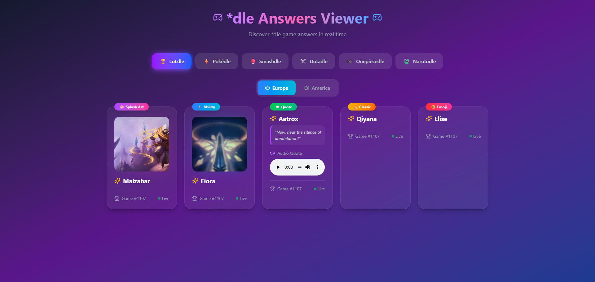

# *dle Answers Viewer 🕹️

A modern React interface to display real-time answers from community *dle games: LoLdle, Pokédle, Smashdle, Dotadle, Onepiecedle, Narutodle...

## 🚀 Aperçu

> Dynamically displays answers (Splash Art, Abilities, Quotes, etc.) depending on the selected game and region, with a responsive and interactive design.



## ✨ Fonctionnalités

- 🎮 Game selector (*dle)
- 🌍 Region selector (Europe / America)
- 📦 Visual display of answers with images, audio, and metadata

## 📦 Technologies

- [React](https://react.dev)
- [Vite](https://vitejs.dev)
- [TypeScript](https://www.typescriptlang.org/)
- [Tailwind CSS](https://tailwindcss.com)
- [Lucide Icons](https://lucide.dev/)

## 🛠️ Installation locale

```bash
git clone https://github.com/Pitchouneee/dle-viewer.git
cd dle-viewer
npm install
npm run dev
```

> By default, the app runs on http://localhost:5173

## 📜 License

This project is licensed under the [MIT License](./LICENSE).  
Feel free to use, modify, and distribute it as you wish.

## 🙌 Contributing

PRs and ideas welcome!
